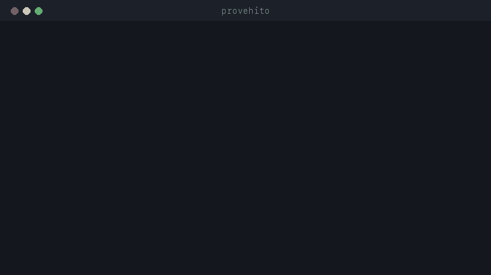

# Provehito

Provehito is a local Go CLI for coordinating AI coding-agent work through
explicit dispatches, frozen Git candidates, evidence checks and independent
review. It never merges or deploys work itself.

## Why I built it

AI coding agents can produce useful patches, but a chat transcript is not a
record of the dispatch, the exact bytes that changed, the evidence that was
checked, or an independent review of that candidate. I built Provehito so those
facts are explicit local state, and so `READY` never means the tool may push,
merge, or deploy.

## Lifecycle

dispatch → run → freeze → review → ready



## 30-second example

Requires Go 1.26. The toolchain is pinned to Go **1.26.7** for reproducible
contributor, CI, and release builds.

```sh
go install github.com/rremedio-web/provehito/cmd/provehito@latest
provehito --version
provehito --help
```

The complete walkthrough is in [docs/quickstart.md](docs/quickstart.md). It
builds the CLI, creates a temporary toy repository, runs the lifecycle, and
ends in `CLOSED` without a model account, network connection, or credential.

## Major engineering decisions

- **State before chat.** Canonical JSON manifests are authoritative. Transcripts
  and agent claims are untrusted.
- **One writer per workspace.** Concurrent writers are rejected.
- **Review frozen bytes.** A review binds to the exact Git candidate fingerprint
  recorded at freeze, not a branch name.
- **No outward actions.** Provehito does not push, merge, deploy, publish, or
  open network sockets. `READY` is a workflow result, not authorization.
- **macOS and Linux only.** JSON is the only authoritative manifest format.

## Current limitations

- Pre-release: there is no stable compatibility promise.
- Windows is unsupported.
- No daemon, dashboard, hosted account, telemetry, chat system, credential
  vault, remote control, automatic cleanup, or external-action integration.
- Process output is bounded in memory for hashing; `agent run` receipts record
  exit status, duration, truncation flags, and stdout/stderr SHA-256 hashes.
  Live streaming is not promised.

## Safety boundary

Configured subprocesses are trusted operator choices and are not sandboxed.
The executable receives its declared argument vector, working directory, and
allowlisted environment, but it can still use host permissions. Use an
operator-supplied OS sandbox when stronger containment is required.

Allowed paths, forbidden paths, and `max_memory_bytes` are recorded policy,
not OS enforcement. `agent run` does enforce the declared time and
captured-output limits. Agent output is untrusted and cannot approve, review,
or transition a lane.

## Test and security status

Provehito is a pre-release local CLI. CI currently validates the project on
macOS and Linux. Security automation includes gitleaks, govulncheck and
deterministic SBOM generation. The project has not yet published a stable
release. See [docs/releasing.md](docs/releasing.md) for release modes, receipts,
and remote gate boundaries.

## AI-assisted development

Provehito was developed with extensive Claude Code and Codex assistance. I
retained ownership of the requirements, architecture, testing, and final
review.

## Command map

| Command | Purpose |
| --- | --- |
| `init` | Create a private state root outside the assigned workspace. |
| `doctor` | Read-only checks for the OS, Git, schema, state, and separation. |
| `lane open` | Record a complete dispatch and activate a lane. |
| `lane list` | Read-only aggregate of current lane state. |
| `lane validate` / `lane status` | Read a manifest and its current hash. |
| `lane block` / `resume` / `abandon` / `incident` | Apply explicit lifecycle events. |
| `agent run` | Run one configured local process in the foreground. |
| `freeze` | Bind a clean Git candidate to exact fingerprints. |
| `evidence add` / `verify` | Add or verify content-addressed receipts. |
| `review open` / `record` | Inspect the frozen candidate and record a verdict. |
| `ready` | Check review and evidence requirements; reports `READY` only. |
| `close` | Close a ready lane. |
| `version` | Print version, commit, and build date. |

Every command has `--json`, with stable `ok`, `command`, `class`, `message`,
optional `correction`, and `data` fields. See [docs/lifecycle.md](docs/lifecycle.md),
[docs/manifest.md](docs/manifest.md), [docs/evidence.md](docs/evidence.md), and
[docs/troubleshooting.md](docs/troubleshooting.md).
